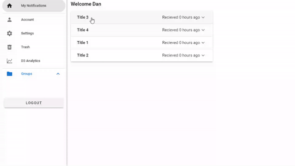

# CSCI3230U - Final Project

Group project Members: Nathan Beals, Daniel Bullock, Sinthooran Ravinathan & Alexander Waddell


## What is it?

Notifier is a notification center, a central hub to display all of your notifications you acculmulate throughout your different applications. It was created using VueJS/Vuetify, and its backend is run with the help of PostgreSQL and GraphQL.



## Project setup

The project is broken into to mostly separate components: **frontend** and **backend**.

### Frontend

* Defaults:
  * Port: `8080`

#### Install Dependencies

```bash
npm install
```

#### Compiles and hot-reloads for development

* this will proxy api requests (all requests sent to the `/api` route to `localhost:8080`)

```bash
npm run serve
```

#### Compiles and minifies for production
```bash
npm run build
```

#### Run your unit tests
```bash
npm run test:unit
```

#### Lints and fixes files
```bash
npm run lint
```


---

### Backend

* Defaults:
  * Port: `8081`

#### Install Dependencies

```bash
npm install
```
* PostgreSQL was used as our Database, you can download the latest version here: https://www.enterprisedb.com/downloads/postgres-postgresql-downloads
* To run the database create a db called "webdev."
* Be sure to edit the config.json in backend/config to reflect your postgres login credentials.

#### Run

```bash
npm run start
```

#### Hot-reloads for development

* this allows for debugging via the `inspector` protocol

```bash
npm run debug
```

#### Run your unit tests

```bash
npm run test:unit
```

#### Lints and fixes files

```bash
npm run lint
```


